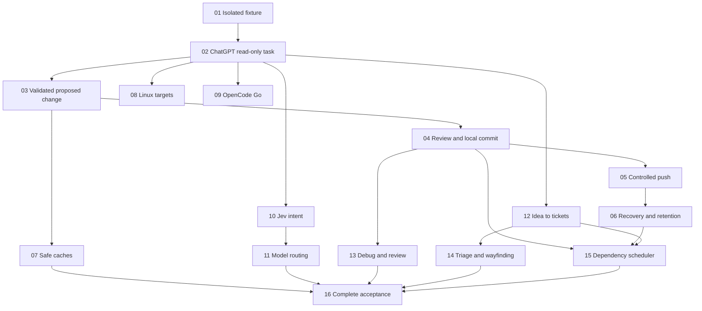

# PI Lead approved ticket graph

Status: approved and published as 16 individual local tickets. Application implementation is not started and remains paused until requested.

Source: [approved specification](spec.md). Each linked ticket is the authoritative scope, acceptance criteria and implementation context for that slice.

## Ticket index

| Ticket | Blocked by | Outcome |
| --- | --- | --- |
| [01: Install a Lead and complete an isolated fixture task](issues/01-isolated-fixture.md) | None | activate the package in a disposable consuming project, request a harmless fixture task, see it in a named background Herdr tab inside Gondolin, collect its result, and close it with a final summary. |
| [02: Complete a ChatGPT Pro read-only worker task](issues/02-chatgpt-worker.md) | 01 | ask the Lead a bounded question about selected project inputs and receive a correlated answer from a visible, fully isolated Pi worker using ChatGPT Pro. |
| [03: Return a validated proposed change from a private workspace](issues/03-validated-proposed-change.md) | 02 | request a small edit; the worker uses a private project copy and mise toolchain, runs the required checks inside isolation, and returns a proposed change with validation evidence for review. |
| [04: Review, fix and commit a complete local coding task](issues/04-review-fix-commit.md) | 03 | a coding task produces independently reviewed, validated commits on a task branch and a summary of review corrections. |
| [05: Push validated task branches through explicit policy](issues/05-controlled-push.md) | 04 | automatically push a validated task branch to the configured consuming-project remote, while gated actions remain concrete requests for human approval. |
| [06: Recover interrupted work and retain useful diagnostics](issues/06-recovery-retention.md) | 05 | after a Lead/wrapper failure, tab closure or interrupted push, recover an accurate task view without duplicate execution, and resume only after confirmation. |
| [07: Reuse safe toolchain caches across repeated tasks](issues/07-safe-toolchain-caches.md) | 03 | repeated project tasks use mise-managed versions and read-only cache seeds with private writable storage, accompanied by measured startup improvements or an honest lack of improvement. |
| [08: Run the isolated task path on both Linux architectures](issues/08-linux-hosts.md) | 02 | the same install → Lead → ChatGPT worker → result → cleanup scenario works on Ubuntu 24.04 LTS x86_64 and arm64, with evidence alongside macOS arm64. |
| [09: Use OpenCode Go when included quota is available](issues/09-opencode-go.md) | 02 | an allowed worker task can use Pi's native OpenCode Go provider and safely stop when included quota is exhausted. |
| [10: Route natural-language intent through bounded Jev calls](issues/10-jev-intent-routing.md) | 02 | natural-language input selects an allowed workflow entry using Jev through OpenRouter; chat, uncertain input and service failure produce predictable visible outcomes. |
| [11: Select allowed models and reasoning at worker spawn](issues/11-model-reasoning-routing.md) | 10 | the Lead assigns bounded tasks to adequate permitted model/reasoning combinations and reports the actual selections and fallback decisions. |
| [12: Turn an idea into approved specs and vertical tickets](issues/12-idea-to-tickets.md) | 02 | a natural-language planning request runs Ask Matt and grill-with-docs, delegates source research when useful, and produces context/ADRs, a standalone spec and separate dependent tickets after the appropriate reviews. |
| [13: Diagnose bugs and review existing branches](issues/13-debug-and-review.md) | 04 | “debug this” follows the native diagnosis loop and “review this branch” returns independent Standards/Spec findings without forcing an implementation workflow. |
| [14: Triage incoming work and resolve large design maps](issues/14-triage-and-wayfinding.md) | 12 | requests to triage incoming issues or map a large uncertain effort follow Matt's native local-tracker workflows and lead into the approved spec/ticket path. |
| [15: Execute the dependency frontier with two workers](issues/15-dependency-scheduler.md) | 04, 06, 12 | the Lead takes an approved local ticket graph, runs only unblocked work with at most two workers, integrates verified results and leaves an accurate graph when a task blocks or execution is interrupted. |
| [16: Verify reusable installation and the current release experience](issues/16-complete-acceptance.md) | 07, 11, 13, 14, 15 | a fresh consuming project can install a pinned package and complete the macOS arm64/ChatGPT Pro workflows with Ubuntu and OpenCode Go explicitly deferred. |

## Dependency overview

## Scope coverage

| Approved spec stories | Primary ticket coverage |
| --- | --- |
| 1–2, 5–7, 17–18, 20–23, 36–37, 41–42 | 01–02, extended by 06 and 16 |
| 3 | 08 (deferred from the current release) |
| 4, 25–26 | 03, 07 |
| 8–9, 31–34 | 10–11 |
| 10–14, 24 | 12, 14–15 |
| 15–16, 35 | 04, 13 |
| 19 | 04, 15 |
| 27–28 | 04–05 |
| 29–30 | 02; 09 is deferred from the current release |
| 38–40 | 01, 06 |

## Approval and execution

The user approved the specification and architectural decisions, then approved this granularity and dependency graph. Tickets are published one per file with ready-for-agent status; that status indicates specification readiness and does not waive unfinished blockers or the current implementation hold.

Ticket 01 is the only dependency-free ticket. No ticket is claimed or complete. Repository initialization follows bootstrap phase 6; begin application work only when the user asks to start.
